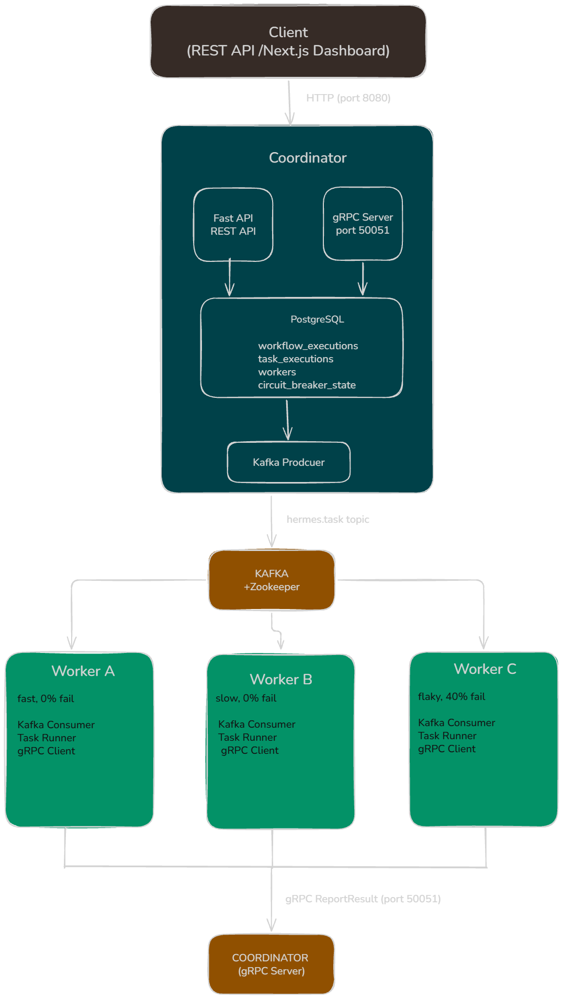

# Hermes — Architecture

**Version:** 1.0  
**Last Updated:** May 2026  
**Author:** Nathan Ivor Sequeira

---

## Overview

Hermes is a distributed workflow orchestration platform. It accepts workflow execution requests via a REST API, distributes tasks to workers through Kafka, collects results via gRPC, and maintains full observability through distributed tracing and metrics.

The core design principle is **nothing lost** — every task is persisted before it is dispatched, every outcome is recorded, and every failure triggers a structured recovery path.

---

## System Diagram



---

## Components

### Coordinator

**Role:** The central brain of Hermes. Accepts workflow submissions, publishes tasks to Kafka, receives results from workers via gRPC, and maintains all state in PostgreSQL.

**Technology:** FastAPI (async Python), SQLAlchemy async, confluent-kafka producer, grpc.aio server

**Runs two servers simultaneously:**

- FastAPI on port 8000 (mapped to 8080 externally) — REST API for clients
- gRPC server on port 50051 — internal communication with workers

**Key responsibilities:**

- Validate and persist workflow execution requests
- Publish task messages to `hermes.tasks` Kafka topic
- Receive `ReportResult` gRPC calls from workers
- Update task and workflow state in PostgreSQL
- Schedule retries with exponential backoff
- Maintain circuit breaker state per worker
- Expose Prometheus metrics at `/metrics`
- Serve health (`/health`) and readiness (`/ready`) probes

---

### Workers

**Role:** Stateless task executors. Each worker subscribes to the `hermes.tasks` Kafka topic, executes tasks, and reports results back to the coordinator via gRPC.

**Technology:** FastAPI (for health/debug endpoints), confluent-kafka consumer, grpc.aio client

**Three worker instances with distinct personalities:**

| Worker   | Failure Rate | Task Duration | Purpose                                 |
| -------- | ------------ | ------------- | --------------------------------------- |
| worker-a | 0%           | 0.3s          | Fast baseline                           |
| worker-b | 0%           | 4.0s          | Slow baseline                           |
| worker-c | 40%          | 1.5s          | Flaky — tests retry and circuit breaker |

**Key responsibilities:**

- Consume task messages from Kafka
- Execute tasks (simulated with configurable duration and failure rate)
- Call coordinator's `ReportResult` gRPC endpoint with outcome
- Send periodic heartbeats to coordinator every 30 seconds

---

### PostgreSQL

**Role:** Single source of truth for all persistent state.

**Key tables:**

| Table                   | What it stores                                              |
| ----------------------- | ----------------------------------------------------------- |
| `workflow_definitions`  | Templates — name and steps configuration                    |
| `workflow_executions`   | One row per workflow run — state, trace_id, timestamps      |
| `task_executions`       | One row per task attempt — state, worker, duration, retries |
| `workers`               | Registered workers — last heartbeat timestamp               |
| `circuit_breaker_state` | Per-worker circuit state — CLOSED, OPEN, HALF_OPEN          |
| `users`                 | Authenticated users — hashed passwords, JWT auth            |

---

### Kafka + Zookeeper

**Role:** Durable task queue. Decouples the coordinator from workers — neither needs to know the other's address.

**Topics:**

| Topic              | Purpose                                            |
| ------------------ | -------------------------------------------------- |
| `hermes.tasks`     | Live task queue — workers consume from here        |
| `hermes.tasks.dlq` | Dead letter queue — exhausted tasks published here |

**Message schema (`hermes.tasks`):**

```json
{
  "task_execution_id": "uuid",
  "execution_id": "uuid",
  "step_name": "validate",
  "step_index": 0,
  "idempotency_key": "{execution_id}:{step_index}:{attempt_number}",
  "timeout_seconds": 10,
  "max_retries": 3,
  "attempt_number": 1,
  "input_payload": {},
  "traceparent": "00-<trace_id>-<span_id>-01"
}
```

The `traceparent` field carries the OpenTelemetry trace context across the Kafka boundary — linking coordinator and worker spans in the same trace.

---

### gRPC Interface

**Definition:** `proto/hermes.proto` — single source of truth

**Service: TaskService**

| RPC            | Direction            | Purpose                                                        |
| -------------- | -------------------- | -------------------------------------------------------------- |
| `ReportResult` | Worker → Coordinator | Report task outcome (success/failure, duration)                |
| `Heartbeat`    | Worker → Coordinator | Signal worker is alive, trigger circuit breaker timeout checks |

The proto file is copied to `coordinator/proto/` and `worker/proto/` for independent Docker builds. Python stubs are generated using `grpc_tools.protoc` and committed to `coordinator/generated/` and `worker/generated/`.

---

### OpenTelemetry + Jaeger

**Role:** Distributed tracing — links spans across coordinator and worker into a single trace per workflow execution.

**Flow:**

1. Coordinator creates a span when `POST /workflows/execute` is called
2. Span context is serialised as a `traceparent` string and embedded in the Kafka message
3. Worker extracts the `traceparent` from the Kafka message and creates a child span
4. Both spans are exported to the OTel Collector at `otel-collector:4317`
5. OTel Collector forwards to Jaeger
6. Full trace visible in Jaeger UI at `http://localhost:16686`

---

### Prometheus + Grafana

**Role:** Metrics collection and dashboards.

**Custom metrics exposed at `/metrics`:**

| Metric                             | Type      | Labels                | What it measures                              |
| ---------------------------------- | --------- | --------------------- | --------------------------------------------- |
| `hermes_tasks_total`               | Counter   | `worker_id`, `status` | Task completions by worker and outcome        |
| `hermes_task_duration_seconds`     | Histogram | `worker_id`           | Execution duration distribution               |
| `hermes_workflow_executions_total` | Counter   | —                     | Total workflows submitted                     |
| `hermes_circuit_breaker_state`     | Gauge     | `worker_id`           | Circuit state (0=CLOSED, 1=OPEN, 2=HALF_OPEN) |

Prometheus scrapes `coordinator:8000/metrics` every 15 seconds. Grafana auto-provisions a dashboard from `monitoring/grafana/provisioning/` on startup.

---

### Next.js Dashboard

**Role:** Web UI for live platform monitoring.

**Pages:**

| Page          | What it shows                                             |
| ------------- | --------------------------------------------------------- |
| `/`           | Summary stats + bar chart + donut chart, 10s auto-refresh |
| `/executions` | Full execution list with state badges, submit button      |
| `/workers`    | Worker cards with circuit breaker state                   |
| `/dlq`        | Dead-lettered tasks with error messages                   |

Calls the coordinator REST API at `http://localhost:8080`. JWT token stored in localStorage. CORS enabled on coordinator for `http://localhost:3000`.

---

## Data Flow — Workflow Execution

```
1. Client sends POST /workflows/execute
        ↓
2. Coordinator validates request, creates WorkflowExecution (RUNNING)
   and TaskExecution (QUEUED) rows in PostgreSQL
        ↓
3. Coordinator creates OTel span, injects traceparent
        ↓
4. Coordinator publishes task message to hermes.tasks (Kafka)
        ↓
5. Worker consumes message from hermes.tasks
        ↓
6. Worker extracts traceparent, creates child OTel span
        ↓
7. Worker executes task (simulated)
        ↓
8. Worker calls gRPC ReportResult → Coordinator
        ↓
9. Coordinator updates TaskExecution (SUCCESS or FAILED)
        ↓
   ┌────────────────────────────────────────────────────────┐
   │                  SUCCESS path                          │
   │  All tasks SUCCESS → WorkflowExecution = COMPLETED    │
   └────────────────────────────────────────────────────────┘
   ┌────────────────────────────────────────────────────────┐
   │                  FAILURE path                          │
   │  attempt < max_attempts:                              │
   │    → New TaskExecution (RETRYING) with backoff        │
   │    → Retry scheduler re-publishes to Kafka            │
   │  attempt == max_attempts:                             │
   │    → TaskExecution = DEAD_LETTERED                    │
   │    → Published to hermes.tasks.dlq                    │
   │    → WorkflowExecution = FAILED                       │
   └────────────────────────────────────────────────────────┘
        ↓
10. Coordinator updates circuit breaker state for worker
11. Prometheus metrics updated
12. OTel spans exported → Jaeger
```

---

## Retry Logic

Failed tasks are retried with exponential backoff:

```
delay = min(2 ^ attempt_number, 30) seconds

attempt 1 failed → retry in 2s
attempt 2 failed → retry in 4s
attempt 3 failed → DEAD_LETTERED
```

Each retry is a new `TaskExecution` row with a unique `idempotency_key`:

```
{execution_id}:{step_index}:{attempt_number}
```

The idempotency key prevents double execution if a task is reassigned to a different worker.

---

## Circuit Breaker

Tracks worker health in the coordinator. Three states:

```
CLOSED      normal operation — tasks flow freely
    ↓ (3 consecutive failures)
OPEN        worker unhealthy — circuit tripped
    ↓ (30s timeout + heartbeat)
HALF_OPEN   one probe task allowed
    ↓ success          ↓ failure
CLOSED              OPEN (reset timeout)
```

State persisted in PostgreSQL `circuit_breaker_state` table. Updated on every `ReportResult` call. OPEN → HALF_OPEN transition triggered by worker Heartbeat after timeout expires.

---

## Known Limitations

| Limitation                       | Detail                                                                                                                  |
| -------------------------------- | ----------------------------------------------------------------------------------------------------------------------- |
| Single Kafka partition           | Only one worker consumes tasks at a time. Multiple partitions would enable true parallel consumption.                   |
| Circuit breaker is observational | With Kafka-based dispatch, an OPEN circuit cannot block task delivery. Per-worker topics would enable true enforcement. |
| No pagination                    | `GET /workflows/executions` returns all rows — will degrade with large datasets.                                        |
| Static worker registration       | Workers are seeded at coordinator startup. Dynamic registration via heartbeat is partially implemented.                 |
| No task timeout enforcement      | Workers can run indefinitely — `timeout_seconds` is stored but not enforced.                                            |

---

## Development Setup

**Generate gRPC stubs (after modifying proto):**

```bash
python -m grpc_tools.protoc -I coordinator/proto \
  --python_out=coordinator/generated \
  --grpc_python_out=coordinator/generated \
  coordinator/proto/hermes.proto

python -m grpc_tools.protoc -I worker/proto \
  --python_out=worker/generated \
  --grpc_python_out=worker/generated \
  worker/proto/hermes.proto
```

**Run load test:**

```bash
locust -f locustfile.py --host http://localhost:8080
# Open http://localhost:8089
```

**Load test results (20 concurrent users, 90s):**

- 578 requests, 0% failure rate
- 9.18 RPS sustained
- 64ms median on POST /workflows/execute
- 720ms p95 on POST /workflows/execute
